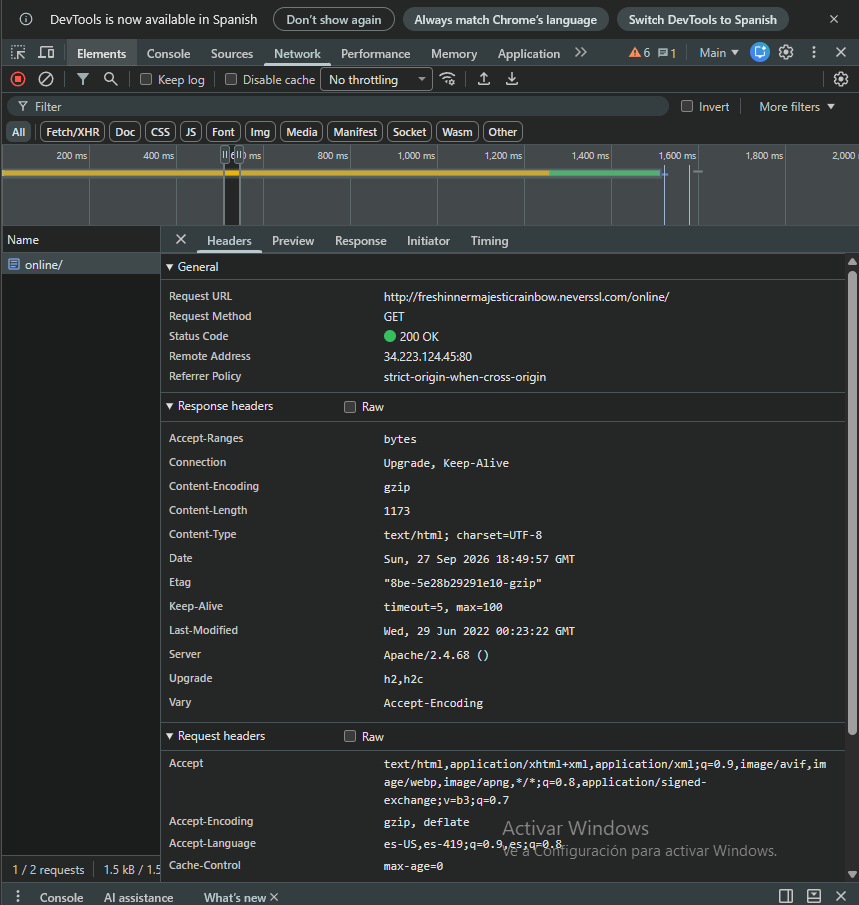
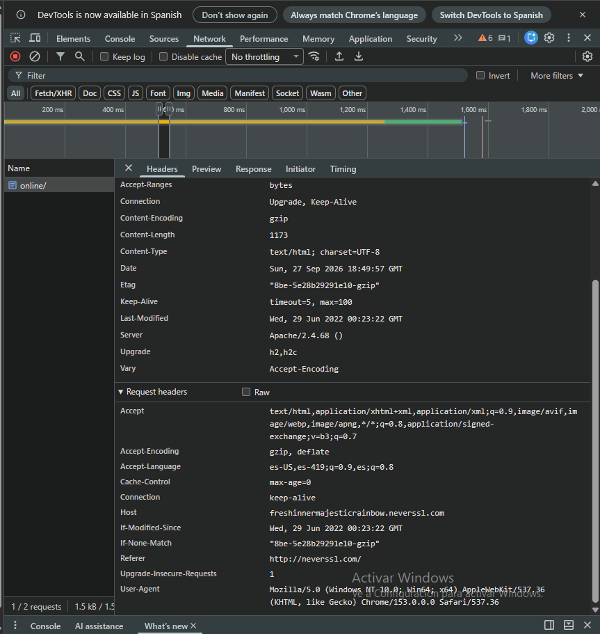

# 📡 Informe de Auditoría de Red Wi-Fi Insegura

> **Práctica:** Seguridad en el aire, o cómo sobrevivir a una Wi-Fi pública
> **Rol:** Auditor de seguridad junior
> **Fecha del análisis:** 27/09/2026
> **Herramienta:** Chrome DevTools (F12 → pestaña *Network*)

---

## 1. Introducción

Al conectarnos a la Wi-Fi de una cafetería, un aeropuerto o una plaza, compartimos el mismo "aire" con decenas de desconocidos. Cualquiera en esa red puede **interceptar** (*sniffing*) los paquetes que viajan entre nuestro dispositivo y el router.

En este informe se analiza una solicitud a un sitio que funciona **solo con HTTP**, para documentar qué información queda expuesta, qué riesgos implica en una red pública y cómo una **VPN** mitiga esos riesgos.

---

## 2. Sitio analizado

| Dato | Valor |
|------|-------|
| Sitio | `http://neverssl.com` (sitio inseguro del laboratorio, a propósito sin cifrado) |
| URL final solicitada | `http://freshinnermajesticrainbow.neverssl.com/online/` |
| Host | `freshinnermajesticrainbow.neverssl.com` |
| Protocolo | **HTTP** (HTTP/1.1, sin TLS) |
| Método | `GET` |
| Código de estado | `200 OK` |
| Dirección remota | `34.223.124.45:80` |

**Conclusión:** el sitio usa **HTTP y no HTTPS**. Lo confirman tres indicios:
1. La URL empieza con `http://`.
2. La conexión va al **puerto 80**, el de HTTP sin cifrar. HTTPS usa el 443.
3. El navegador muestra la advertencia **"No es seguro"** en la barra de direcciones.

El propio sitio lo declara: *"neverssl.com will never use SSL (also known as TLS). No encryption."*

---

## 3. Evidencia observada

### 3.1 Datos generales y cabeceras de respuesta



### 3.2 Cabeceras de la solicitud (Request Headers)



### 3.3 Información visible en texto plano

| Elemento | Valor observado | Qué revela |
|----------|-----------------|------------|
| **Host** | `freshinnermajesticrainbow.neverssl.com` | El sitio exacto que se visita |
| **URL** | `/online/` | La página concreta dentro del sitio |
| **Método** | `GET` | La acción realizada (pedir una página) |
| **User-Agent** | `Mozilla/5.0 (Windows NT 10.0; Win64; x64) ... Chrome/153.0.0.0` | Sistema operativo (Windows 64 bits) y navegador (Chrome 153) |
| **Accept-Language** | `es-US, es-419, es` | El idioma y la región del usuario |
| **Referer** | `http://neverssl.com/` | De qué página venía el usuario |
| **Server** (respuesta) | `Apache/2.4.68` | El software del servidor |
| **Remote Address** | `34.223.124.45:80` | La IP y el puerto del servidor |

Además del encabezado, el **contenido completo de la página** (la respuesta HTML) viaja sin cifrar.

---

## 4. Riesgos encontrados

Con HTTP todo viaja como una **postal escrita a mano**: cualquiera que la toque puede leerla. En una Wi-Fi pública esto habilita los siguientes ataques:

| Riesgo | Descripción | Qué puede obtener el atacante |
|--------|-------------|-------------------------------|
| **Intercepción de datos (Sniffing)** | Con herramientas como **Wireshark**, alguien en la misma red captura los paquetes. | Sitios visitados, páginas, contenido, y **usuarios y contraseñas** si se envía un formulario por HTTP. |
| **Man-in-the-Middle (MitM)** | El atacante se hace pasar por el router y el tráfico pasa por su equipo. | Puede leer **y modificar** la página, por ejemplo para inyectar un formulario falso o malware. |
| **Evil Twin (red gemela maligna)** | Una red falsa con nombre creíble ("Cafe_Gratis"). | Todo el tráfico de quienes se conectan a ella. |
| **Robo de sesión** | Las **cookies de sesión** viajan en texto plano. | Puede entrar a la cuenta sin conocer la contraseña. |
| **Perfilado del usuario** | Con headers como User-Agent, Accept-Language y Referer. | Sistema operativo, navegador, idioma, región y hábitos de navegación. |

> ⚠️ **Mitos comunes:**
> - *"Si la Wi-Fi tiene contraseña, es segura."* **Falso.** Si la clave se reparte a todos los clientes, cualquiera de ellos puede atacar a los demás.
> - *"Solo me pueden hackear si descargo algo."* **Falso.** La navegación por HTTP ya revela identidad, hábitos y sesiones abiertas.

---

## 5. Cómo ayuda una VPN

Una **VPN (Red Privada Virtual)** crea un **túnel seguro** entre el dispositivo y el servidor VPN, dentro de la red pública.

```
SIN VPN:  [Mi PC] --(HTTP legible)--> [Wi-Fi pública / atacante] --> [Internet]
CON VPN:  [Mi PC] ==(túnel cifrado)==> [Wi-Fi pública / atacante] ==> [Servidor VPN] --> [Internet]
```

- **Cifrado:** todo el tráfico sale del dispositivo cifrado con algoritmos robustos como AES. Si alguien lo captura con Wireshark, solo ve **ruido ilegible**.
- **Encapsulamiento y túnel seguro:** cada paquete original (con Host, URL, headers y contenido) se **encapsula** dentro de otro paquete cifrado dirigido al servidor VPN. En la red local solo se ve que hay tráfico hacia la VPN, pero no su contenido ni su destino final.
- **Protección del tráfico:** un atacante MitM o un Evil Twin ya no puede leer ni modificar los datos. Si los altera, la verificación de integridad detecta el cambio y el paquete se descarta.
- **Privacidad:** los sitios visitados ven la **IP del servidor VPN** y no la del usuario, y la red pública no puede saber qué sitios se visitan.

> 📌 **Limitación:** la VPN protege el tramo *dispositivo → servidor VPN*. Entre el servidor VPN y un sitio HTTP el tráfico vuelve a viajar sin cifrar. Por eso la VPN **complementa** a HTTPS y no lo reemplaza.

---

## 6. 🏆 Mis 3 Reglas de Oro para Wi-Fi públicas

1. **🔒 Solo HTTPS, nunca HTTP.**
   Antes de ingresar datos, verificá el candado y que la dirección empiece con `https://`. Si el navegador dice **"No es seguro"**, no ingreses contraseñas ni datos personales. Activá el modo **"Usar siempre conexiones seguras"** del navegador.

2. **🛡️ VPN siempre activa en redes que no controlás.**
   Conectá la VPN **antes** de navegar para que todo el tráfico vaya cifrado por el túnel. Así, aunque la red sea un Evil Twin o haya alguien haciendo sniffing, solo verá tráfico cifrado.

3. **✅ Verificá la red y evitá operaciones sensibles.**
   Preguntá al personal el nombre exacto de la red, desconfiá de nombres como "Gratis" o "Free", y desactivá la conexión automática a redes abiertas. No hagas homebanking ni compras en Wi-Fi pública: para eso usá tus datos móviles.

---

*Informe realizado como parte del curso de Ciberseguridad.*
